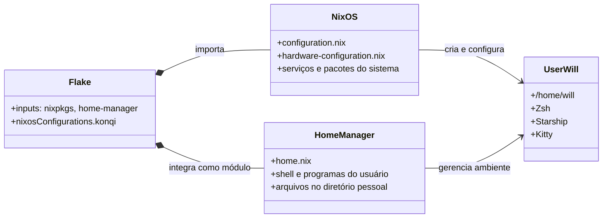
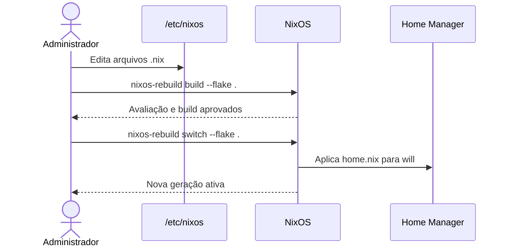

# Configuração NixOS do `konqi`

Configuração declarativa do host **konqi**, baseada em NixOS, Flakes e Home
Manager. O repositório é a fonte de verdade para o sistema operacional e para
o ambiente do usuário `will`.

| Propriedade | Valor |
| --- | --- |
| Host | `konqi` |
| Arquitetura | `x86_64-linux` |
| Canal | `nixos-unstable` |
| Localidade | `pt_BR.UTF-8` |
| Fuso horário | `America/Sao_Paulo` |
| Ambiente gráfico | KDE Plasma 6 com SDDM |

## Arquitetura



O Home Manager é aplicado dentro do mesmo `nixos-rebuild`; não é necessário
executar `home-manager switch` separadamente.

## Estrutura do repositório

| Arquivo | Responsabilidade | Regra de alteração |
| --- | --- | --- |
| `flake.nix` | Entradas, versões e saída `nixosConfigurations.konqi`. Integra o Home Manager. | Altere ao adicionar ou atualizar dependências e módulos. |
| `flake.lock` | Versões exatas das entradas do flake. | Versione toda alteração gerada por `nix flake update`. |
| `configuration.nix` | Opções de sistema, serviços, usuário, rede e pacotes globais. | Use para recursos necessários ao host ou a todos os usuários. |
| `home.nix` | Ambiente declarativo do usuário `will`. | Use para preferências e programas de uso pessoal. |
| `hardware-configuration.nix` | Discos, módulos de kernel e parâmetros detectados. | Não edite manualmente; regenere apenas após mudança de hardware. |

## Recursos administrados

### Sistema

- Inicialização EFI com `systemd-boot` e kernel `linuxPackages_latest`.
- NetworkManager, Wi-Fi, CUPS, PipeWire e `rtkit`.
- KDE Plasma 6, SDDM, teclado ABNT2/ThinkPad e console brasileiro.
- Autenticação biométrica para login, SDDM e `sudo`.
- Firefox, OpenSSH, Tailscale e agente GnuPG com suporte a SSH.
- Recursos experimentais Nix: `nix-command` e `flakes`.

### Usuário `will`

- Zsh como shell padrão, com autosuggestions e syntax highlighting.
- Prompt Starship e terminal Kitty com JetBrains Mono Nerd Font.
- Aliases: `rebuild`, `update`, `nixcode` e `ll`.
- Ferramentas de desenvolvimento, terminal e desktop, incluindo Git, Node.js,
  Python, GCC, Rustup, Bun, Neovim, VS Code, tmux e LibreOffice.

## Editor: micro com LSP

O `micro` é configurado declarativamente pelo `programs.micro` em
`home.nix`. O suporte a autocomplete, definição, referências, assinatura de
funções, formatação e diagnósticos é fornecido pelo plugin
[micro-plugin-lsp](https://github.com/AndCake/micro-plugin-lsp).

### Configuração declarativa (`home.nix`)

```nix
programs.micro = {
  enable = true;
  settings = {
   colorscheme = "monokai";
   tabsize = 4;
   tabstospaces = true;
   autoindent = true;
   syntax = true;
   ruler = true;
   softwrap = false;
   scrollbar = true;
   statusline = true;
   mouse = true;
   clipboard = "external";

   "lsp.server" = "c++=clangd,c=clangd,python=pyright-langserver --stdio,sh=bash-language-server start,rust=rust-analyzer";
   "lsp.formatOnSave" = true;
   "lsp.autocomplete" = true;
   "lsp.diagnostics" = true;
  };
};
```

### Servidores de linguagem no sistema

Os servidores precisam estar no `$PATH` global. Declarar um servidor apenas em
`programs.neovim.extraPackages` o torna disponível somente para o wrapper do
Neovim, e não para outros programas, como o `micro`.

Em `configuration.nix`, mantenha os pacotes necessários em
`environment.systemPackages`:

```nix
environment.systemPackages = with pkgs; [
  clang-tools           # clangd, clang-format e clang-tidy
  pyright
  bash-language-server
  rust-analyzer
];
```

Depois, aplique a configuração:

```bash
rebuild
```

### Instalação única do plugin

O Home Manager não possui uma opção nativa para administrar plugins do
`micro`. Por isso, instale o plugin uma vez por máquina:

```bash
micro -plugin install lsp
```

Para reinstalar ou redefinir o plugin:

```bash
rm -rf ~/.config/micro/plug/lsp
micro -plugin install lsp
```

### Sintaxe de `lsp.server`

O valor usa o formato `<tipo-de-arquivo>=<comando>`, com entradas separadas por
vírgulas. Não use `:` ou `|` como separadores:

```text
c++=clangd,c=clangd,python=pyright-langserver --stdio,sh=bash-language-server start,rust=rust-analyzer
```

### Atalhos gerais

| Atalho | Ação |
| --- | --- |
| `Ctrl+S` | Salvar |
| `Ctrl+Q` | Sair |
| `Ctrl+E` | Abrir a barra de comandos |
| `Ctrl+Z` | Desfazer |
| `Ctrl+Y` | Refazer |
| `Ctrl+F` | Buscar |
| `Ctrl+N` | Próximo resultado |
| `Ctrl+P` | Resultado anterior |
| `Ctrl+G` | Abrir a ajuda |
| `Ctrl+C` | Copiar |
| `Ctrl+V` | Colar |
| `Ctrl+X` | Recortar |
| `Ctrl+A` | Selecionar tudo |
| `Ctrl+D` | Duplicar linha |
| `Ctrl+K` | Recortar linha inteira |

### Navegação

| Atalho | Ação |
| --- | --- |
| `Ctrl+←` / `Ctrl+→` | Avançar ou voltar uma palavra |
| `Ctrl+Home` / `Ctrl+End` | Ir para o início ou fim do arquivo |
| `Alt+←` / `Alt+→` | Recuar ou indentar a linha |
| `Alt+↑` / `Alt+↓` | Mover a linha para cima ou para baixo |

### Múltiplos cursores e seleção

| Atalho | Ação |
| --- | --- |
| `Alt+N` | Adicionar a próxima ocorrência à seleção |
| `Ctrl+Alt+↑` / `Ctrl+Alt+↓` | Adicionar cursor acima ou abaixo |
| `Esc` | Limpar múltiplos cursores |

### Abas e divisões

| Atalho | Ação |
| --- | --- |
| `Ctrl+T` | Nova aba |
| `Alt+,` / `Alt+.` | Aba anterior ou próxima |
| `Ctrl+W` | Divisão vertical |
| `Ctrl+U` | Divisão horizontal |

### Atalhos do LSP

Esses atalhos exigem que um servidor de linguagem esteja em execução:

| Atalho | Ação |
| --- | --- |
| `Ctrl+Space` | Forçar autocomplete |
| `Alt+D` | Ir para a definição |
| `Alt+K` | Exibir assinatura da função |
| `Alt+R` | Listar referências |

### Referência da barra de comandos

Pressione `Ctrl+E` e use um dos comandos abaixo:

| Comando | Ação |
| --- | --- |
| `log` | Exibir o log interno de diagnóstico |
| `plugin list` | Listar plugins instalados e seus status |
| `plugin on <nome>` | Ativar um plugin |
| `plugin off <nome>` | Desativar um plugin |
| `filetype` | Exibir o tipo de arquivo detectado |
| `set <opção> <valor>` | Alterar uma configuração temporariamente |

### Diagnóstico

Se o autocomplete não aparecer, verifique:

1. Se o servidor está no `$PATH`:

  ```bash
  which clangd
  ```

2. Se o plugin está instalado:

  ```bash
  ls -la ~/.config/micro/plug/lsp/
  ```

3. Se há um processo do servidor em execução com um arquivo aberto:

  ```bash
  ps aux | grep clangd
  ```

4. Se a sintaxe de LSP está correta no arquivo de configurações:

  ```bash
  cat ~/.config/micro/settings.json | grep lsp
  ```

5. Se o `home.nix` contém a configuração aplicada:

  ```bash
  grep -A 2 "lsp.server" /etc/nixos/home.nix
  ```

6. Consulte o log interno pelo editor: `Ctrl+E` → `log`.
7. Force o autocomplete manualmente com `Ctrl+Space`.

> **Causa comum:** servidores declarados apenas em `programs.neovim.extraPackages`
> ficam restritos ao ambiente do Neovim. Para que o `micro` e outros programas
> os encontrem, declare-os também em `environment.systemPackages`.

## Operação diária

Execute os comandos a partir de `/etc/nixos` ou informe explicitamente o
caminho do flake.

### Validar antes de aplicar

```bash
sudo nixos-rebuild build --flake /etc/nixos#konqi
```

Esse comando avalia e constrói a nova geração, mas não a ativa.

### Aplicar a configuração

```bash
sudo nixos-rebuild switch --flake /etc/nixos#konqi
```

O `switch` ativa uma nova geração. Se a avaliação ou a construção falhar, a
geração em execução não é modificada.

### Fluxo de mudança



## Atualização de dependências

```bash
cd /etc/nixos
sudo nix flake update
sudo nixos-rebuild build --flake .#konqi
sudo nixos-rebuild switch --flake .#konqi
```

Revise o diff de `flake.lock` antes do commit. Como o projeto acompanha
`nixos-unstable`, atualizações podem introduzir versões novas de pacotes ou
opções incompatíveis.

## Recuperação

O NixOS preserva gerações anteriores. Caso uma geração recém-aplicada apresente
problemas, selecione uma geração anterior no menu do `systemd-boot` durante a
inicialização. Depois de iniciar nela, corrija a configuração e aplique um novo
rebuild.

Para listar as gerações disponíveis:

```bash
sudo nixos-rebuild list-generations
```

## Home Manager e backups

Ao precisar substituir um arquivo existente em `/home/will`, o Home Manager
preserva a cópia anterior com a extensão `.hm-backup`. Revise ou remova esses
arquivos somente após confirmar que a configuração nova está correta.

## Convenções de manutenção

- Mantenha `system.stateVersion` e `home.stateVersion` nos valores de criação;
  eles não determinam a versão para a qual o sistema será atualizado.
- Use `nix fmt` quando houver um formatador configurado para o flake e sempre
  confirme o resultado com `git diff --check`.
- Antes do rebuild, revise `git diff`; após uma mudança validada, registre os
  arquivos `.nix` e, se aplicável, o `flake.lock` no mesmo commit.
- Não armazene senhas, chaves privadas ou tokens neste repositório. Para
  segredos, adote uma solução própria de gerenciamento de segredos antes de
  declará-los na configuração.
