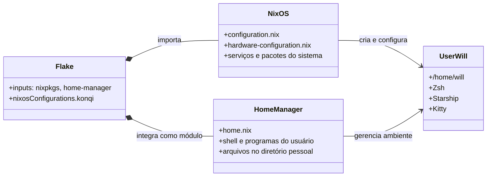
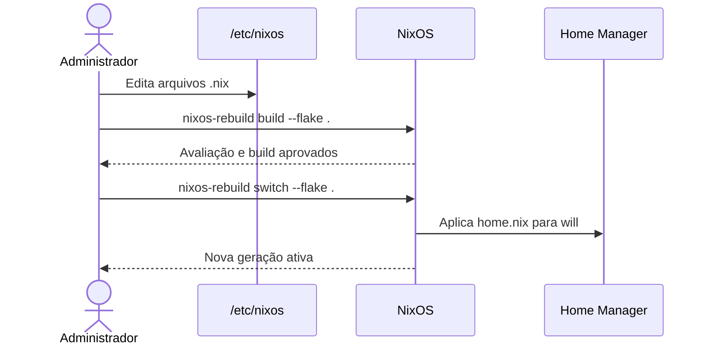

# Configuração NixOS do `konqi`

Configuração declarativa do host **konqi**, baseada em NixOS, Flakes e Home
Manager. O repositório é a fonte de verdade para o sistema operacional e para
o ambiente do usuário `will`.

| Propriedade | Valor |
| --- | --- |
| Host | `konqi` |
| Arquitetura | `x86_64-linux` |
| Canal | `nixos-unstable` |
| Localidade | `pt_BR.UTF-8` |
| Fuso horário | `America/Sao_Paulo` |
| Ambiente gráfico | KDE Plasma 6 com SDDM |

## Arquitetura



O Home Manager é aplicado dentro do mesmo `nixos-rebuild`; não é necessário
executar `home-manager switch` separadamente.

## Estrutura do repositório

| Arquivo | Responsabilidade | Regra de alteração |
| --- | --- | --- |
| `flake.nix` | Entradas, versões e saída `nixosConfigurations.konqi`. Integra o Home Manager. | Altere ao adicionar ou atualizar dependências e módulos. |
| `flake.lock` | Versões exatas das entradas do flake. | Versione toda alteração gerada por `nix flake update`. |
| `configuration.nix` | Opções de sistema, serviços, usuário, rede e pacotes globais. | Use para recursos necessários ao host ou a todos os usuários. |
| `home.nix` | Ambiente declarativo do usuário `will`. | Use para preferências e programas de uso pessoal. |
| `hardware-configuration.nix` | Discos, módulos de kernel e parâmetros detectados. | Não edite manualmente; regenere apenas após mudança de hardware. |

## Recursos administrados

### Sistema

- Inicialização EFI com `systemd-boot` e kernel `linuxPackages_latest`.
- NetworkManager, Wi-Fi, CUPS, PipeWire e `rtkit`.
- KDE Plasma 6, SDDM, teclado ABNT2/ThinkPad e console brasileiro.
- Autenticação biométrica para login, SDDM e `sudo`.
- Firefox, OpenSSH, Tailscale e agente GnuPG com suporte a SSH.
- Recursos experimentais Nix: `nix-command` e `flakes`.

### Usuário `will`

- Zsh como shell padrão, com autosuggestions e syntax highlighting.
- Prompt Starship e terminal Kitty com JetBrains Mono Nerd Font.
- Aliases: `rebuild`, `update`, `nixcode` e `ll`.
- Ferramentas de desenvolvimento, terminal e desktop, incluindo Git, Node.js,
  Python, GCC, Rustup, Bun, Neovim, VS Code, tmux e LibreOffice.

## Operação diária

Execute os comandos a partir de `/etc/nixos` ou informe explicitamente o
caminho do flake.

### Validar antes de aplicar

```bash
sudo nixos-rebuild build --flake /etc/nixos#konqi
```

Esse comando avalia e constrói a nova geração, mas não a ativa.

### Aplicar a configuração

```bash
sudo nixos-rebuild switch --flake /etc/nixos#konqi
```

O `switch` ativa uma nova geração. Se a avaliação ou a construção falhar, a
geração em execução não é modificada.

### Fluxo de mudança



## Atualização de dependências

```bash
cd /etc/nixos
sudo nix flake update
sudo nixos-rebuild build --flake .#konqi
sudo nixos-rebuild switch --flake .#konqi
```

Revise o diff de `flake.lock` antes do commit. Como o projeto acompanha
`nixos-unstable`, atualizações podem introduzir versões novas de pacotes ou
opções incompatíveis.

## Recuperação

O NixOS preserva gerações anteriores. Caso uma geração recém-aplicada apresente
problemas, selecione uma geração anterior no menu do `systemd-boot` durante a
inicialização. Depois de iniciar nela, corrija a configuração e aplique um novo
rebuild.

Para listar as gerações disponíveis:

```bash
sudo nixos-rebuild list-generations
```

## Home Manager e backups

Ao precisar substituir um arquivo existente em `/home/will`, o Home Manager
preserva a cópia anterior com a extensão `.hm-backup`. Revise ou remova esses
arquivos somente após confirmar que a configuração nova está correta.

## Convenções de manutenção

- Mantenha `system.stateVersion` e `home.stateVersion` nos valores de criação;
  eles não determinam a versão para a qual o sistema será atualizado.
- Use `nix fmt` quando houver um formatador configurado para o flake e sempre
  confirme o resultado com `git diff --check`.
- Antes do rebuild, revise `git diff`; após uma mudança validada, registre os
  arquivos `.nix` e, se aplicável, o `flake.lock` no mesmo commit.
- Não armazene senhas, chaves privadas ou tokens neste repositório. Para
  segredos, adote uma solução própria de gerenciamento de segredos antes de
  declará-los na configuração.
